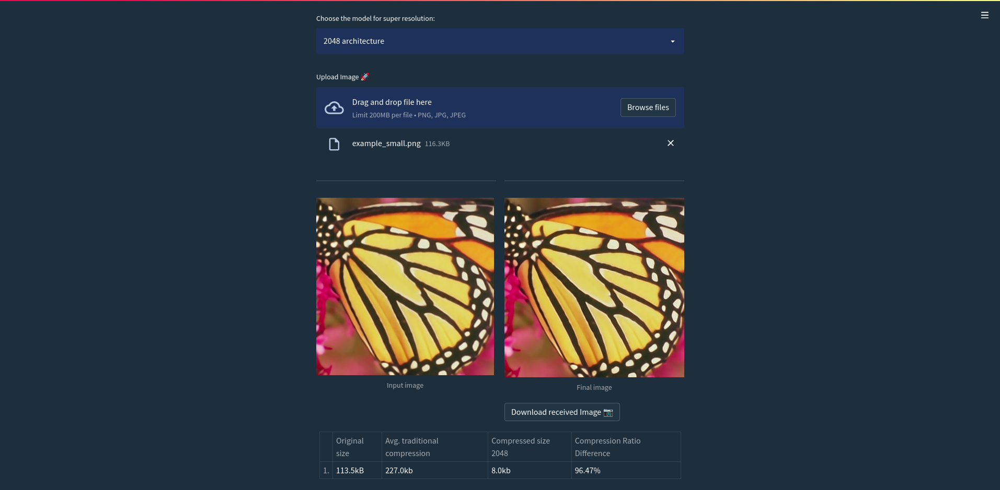

# DataLite

An innovative approach involves merging an auto-encoder with a super-resolution model to efficiently compress images while simultaneously improving their quality. The auto-encoder handles image compression, while the super-resolution model enhances the output quality of the auto-encoder.
This methodology is then contrasted with the conventional JPEG and PNG standards for performance evaluation.

PS: Install pytorch==1.7.1 and tensorflow==2.9 manually.
